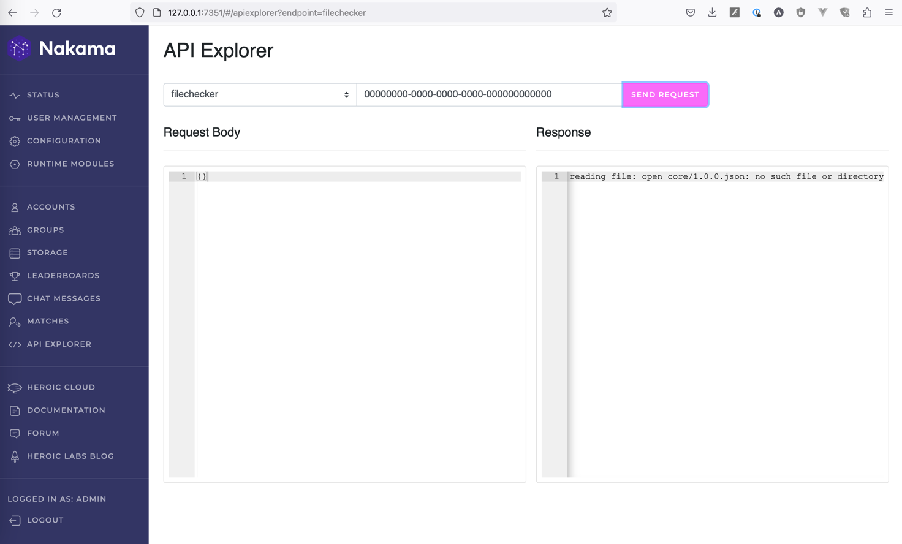
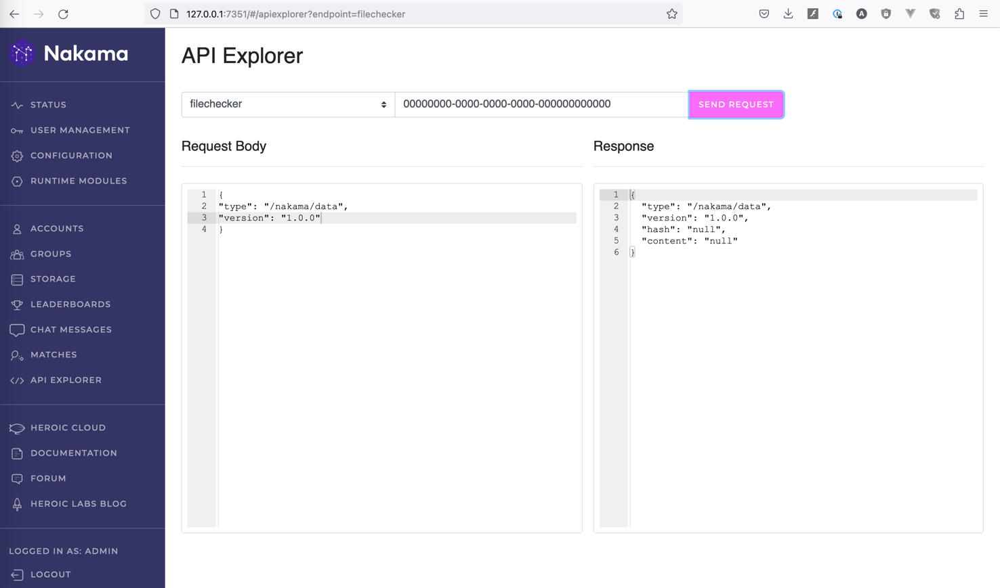

# Additional handler for Nakama

## What has been added?

New FileChecker endpoint has been created with the following input
```go
{
    Type    string `json:"type,omitempty"`
    Version string `json:"version,omitempty"`
    Hash    string `json:"hash,omitempty"`
}
```
and output parameters
```go
{
    Type    string `json:"type"`
    Version string `json:"version"`
    Hash    string `json:"hash"`
    Content string `json:"content"`
}
```
Request parameters are validated and default values - type=core, version=1.0.0, hash=null - are set if parameter is empty.

Just run "docker compose up" and you will get the nakama with the new endpoint.

## New endpoint logic

* Read a file from the disk (path=type/version.json)
* Calculate file content hash. If hashes are not equal, then the content is "null".
* Save data to the database (Fields: path, content, created_at, updated_at)
* If the file doesn't exist, then return an error.

## What can be improved/added in the future?

* Change [default parameters](https://heroiclabs.com/docs/nakama/getting-started/configuration/#common-properties) for nakama
* Discuss the endpoint name
* Discuss the hash function being used
* Extend the request parameters with type of the hash function and limit for the file content size
* Add limiter for the endpoint
* Read the file with the help of buffer. Maybe it will be a good idea to limit file size to read and additinally validate input parameters to prevent system files access
* Save request parameters to the database along with the request results (currently it's just an example of working with database)
* Configure a separate database to store data for the new endpoint (as for me, it's not good to use nakama database to store your own data)
* Discuss the logging rules

## Test data

There are two test files in the repository:

* /nakama/data/1.0.0.json (hash: 312119bc2ec8e367a4a7320a49eba3972ddfb3c04c7bc948ecda97a5429947de)
```json
{
  "field01": "really long text",
  "field02": 1234567890,
  "field03": 1234567890.1234567890,
  "field04": true
}
```
* /nakama/data/1.0.1.json (hash: 4e8b76ab4f85f91d3a5fcd17198de10a280673abb4852fb8e2c5634779aac84e)
```json
{
  "field01": "really long text"
}
```

## Examples of usage

### Empty request


### Request for 1.0.0.json with correct hash


### Request for 1.0.0.json with incorrect hash



